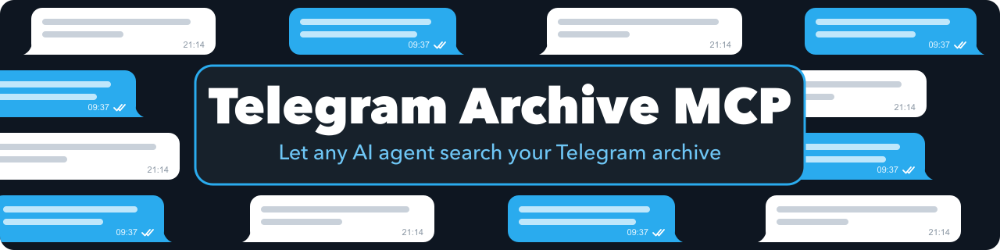
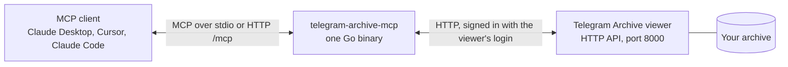

---
hide:
  - navigation
---

# telegram-archive-mcp { .tam-visually-hidden }

  

  
  
  
  

---

**telegram-archive-mcp** lets Claude, Cursor or any other MCP client read the Telegram history you keep with [Telegram Archive](https://geiserx.github.io/Telegram-Archive/). Without it, the archive is a web viewer you search by hand, one chat at a time. With it, you ask the assistant "what was the address someone posted in the climbing group last spring?" and it finds the chat, searches it, reads the messages of the right day and answers from them. It signs in to your viewer the way a browser does, only reads, and runs as one Go binary with no database of its own. Start with [Getting started](getting-started.md), then [Usage](usage.md) for what the assistant can read.

-   :material-download: **[Getting started](getting-started.md)**

    ---

    `npx` for Claude Desktop, Cursor and Claude Code, the Docker image for a server over HTTP, or a local Go build.

-   :material-connection: **[Connect your client](configuration.md#client-configuration)**

    ---

    The `mcpServers` block for stdio, and the `url` block with a bearer token for a server you run over HTTP.

-   :material-chat-question-outline: **[Usage](usage.md)**

    ---

    The 4 resources and 9 tools, their arguments, paging through a long chat and reading one day at a time.

-   :material-format-list-bulleted: **[Configuration](configuration.md)**

    ---

    Every environment variable and its default.

## What the assistant can read

- Your chats and folders, with the ids the other tools take (`list_chats`, `list_folders`).
- Messages that contain a keyword in one chat (`search_messages`).
- A chat's messages, newest first, as far back as the archive goes (`get_messages`), or every message of one calendar day in your timezone (`get_messages_by_date`).
- Pinned messages, forum topics and per-chat statistics, and the archive's totals and health as resources.

The full list with every argument is on [Usage](usage.md).

## How it runs

- Over stdio the client starts the binary itself; that is what `npx -y telegram-archive-mcp` does, and it is the mode for a client on the same machine.
- Over HTTP the binary serves `/mcp` on `127.0.0.1:8080`. Listening on any other address requires `MCP_AUTH_TOKEN`, which clients then send as a bearer token. See [Configuration](configuration.md).
- It signs in with `TELEGRAM_ARCHIVE_USER` and `TELEGRAM_ARCHIVE_PASS` through the viewer's `/api/login`, keeps the session cookie in memory, and signs in again when it expires.
- The same version ships as Go binaries for Linux, macOS and Windows on amd64 and arm64, the npm package and the Docker image `drumsergio/telegram-archive-mcp`.

## What it does not do

- It never talks to Telegram. It reads what your Telegram Archive backup has already saved, so a message the backup has not fetched yet is not there.
- It never sends, edits or deletes a message, in Telegram or in the archive. The one call that asks the viewer to do work is `refresh_stats`, which recalculates the statistics.
- It does not search every chat at once: `search_messages` searches one chat, so the assistant lists the chats first and picks.
- It stores nothing. No database and no cache; every answer is read from the viewer when it is asked for.

## Privacy

- Every message a tool returns goes into your MCP client's conversation, and from there to the model the client uses. With a hosted model, that provider receives those messages. Point the server at an archive you are willing to share that way, and keep your client's tool-approval prompts on.
- The server logs its version and its listen address, never message text, chat names or credentials.
- Over stdio, the viewer's password sits in your client's configuration file. Over HTTP, it stays on the machine that runs the server.

## Getting help

- A tool answers `login failed` with a status code: `TELEGRAM_ARCHIVE_USER` or `TELEGRAM_ARCHIVE_PASS` does not match a viewer login. See [Configuration](configuration.md).
- Every call fails with a connection error: `TELEGRAM_ARCHIVE_URL` does not reach the viewer. Inside Docker Compose it is the viewer's service name, as in [Getting started](getting-started.md#docker-compose).
- The server exits with `MCP_AUTH_TOKEN is required when LISTEN_ADDR is not loopback`: set a token, or listen on `127.0.0.1`.
- Something else: open an [issue](https://github.com/GeiserX/telegram-archive-mcp/issues) with the server's log lines. A security problem goes through the [security policy](https://github.com/GeiserX/telegram-archive-mcp/blob/main/SECURITY.md), never a public issue.
- Building, testing with MCP Inspector and sending a fix: [Development](development.md). Telegram Archive itself, other MCP servers and where this one is listed: [Related projects](related.md).

## License

telegram-archive-mcp is released under the [GPL-3.0-or-later](https://github.com/GeiserX/telegram-archive-mcp/blob/main/LICENSE) license. It is built on [mcp-go](https://github.com/mark3labs/mcp-go).
